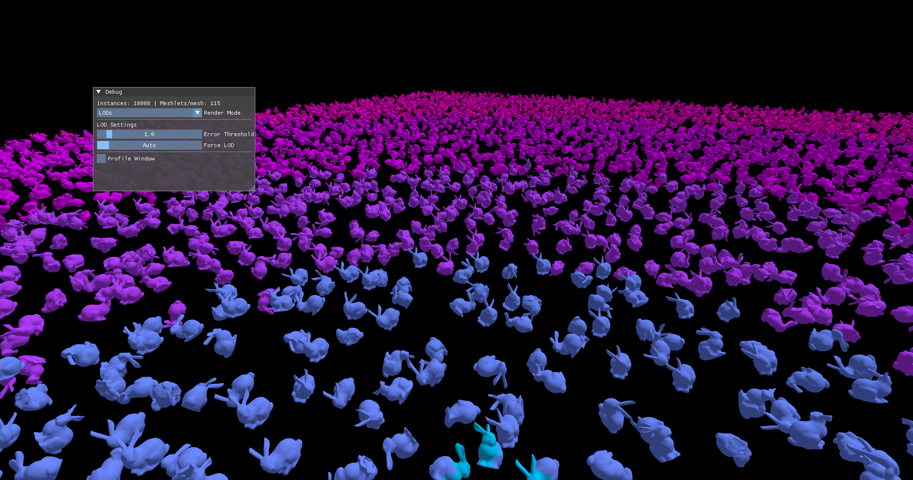
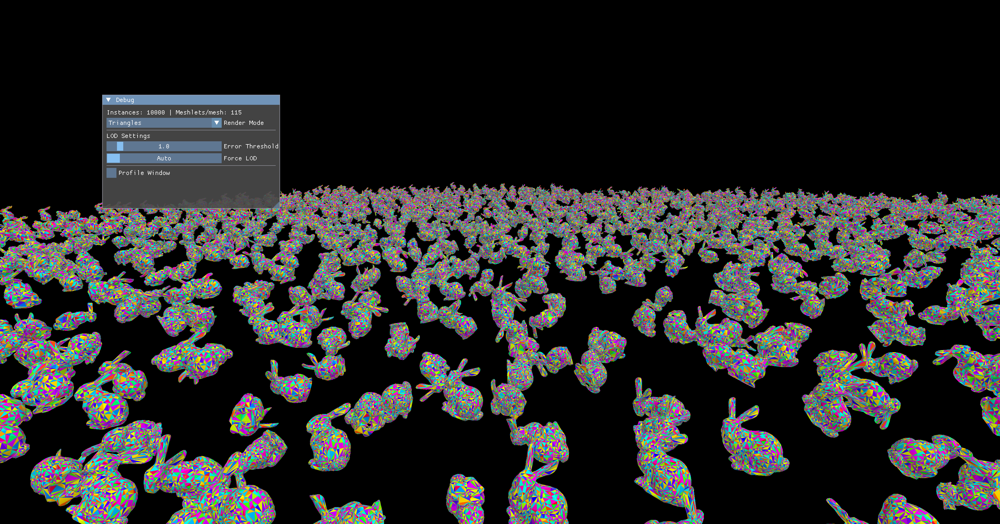

# Mesh Shaders

A Vulkan renderer implementing Nanite style virtualized geometry using mesh shaders and hierarchical LODs.

---

An implementation of the techniques described in [Nanite at Home](https://knnyism.com/posts/nanite/) — building a Nanite-inspired GPU-driven renderer from scratch. This project follows that article step by step in C++ and GLSL, using `VK_EXT_mesh_shader`.

10,000 instances, each with full per meshlet LOD selection running entirely on the GPU.

---

- **Mesh shader pipeline** — task shader + mesh shader via `VK_EXT_mesh_shader` | each mesh shader workgroup processes one meshlet
- **Meshlet generation** — clusters of up to 64 vertices / 126 triangles built with [meshoptimizer](https://github.com/zeux/meshoptimizer)
- **Hierarchical LOD DAG** — groups of meshlets are iteratively simplified and re-split; the DAG is built via `clodBuild` from meshoptimizer
- **Instance level frustum culling** — bounding sphere tested against view frustum before dispatching any meshlets for an instance
- **Meshlet level frustum culling** — per-meshlet bounding sphere tested in the task shader
- **Backface cone culling** — meshlets with a normal cone facing away from camera are rejected in the task shader

---

## References

- [Nanite at Home](https://knnyism.com/posts/nanite/) — knnyism. The article this project is based on.
- [Kynetic](https://github.com/knnyism/Kynetic) — reference implementation by the article author
- [meshoptimizer](https://github.com/zeux/meshoptimizer) — meshlet generation and LOD simplification
- [Creating a Directed Acyclic Graph from a Mesh](https://blog.traverseresearch.nl/creating-a-directed-acyclic-graph-from-a-mesh-1329e57286e5) — Traverse Research
- [Introduction to Turing Mesh Shaders](https://developer.nvidia.com/blog/introduction-turing-mesh-shaders/) — NVIDIA
